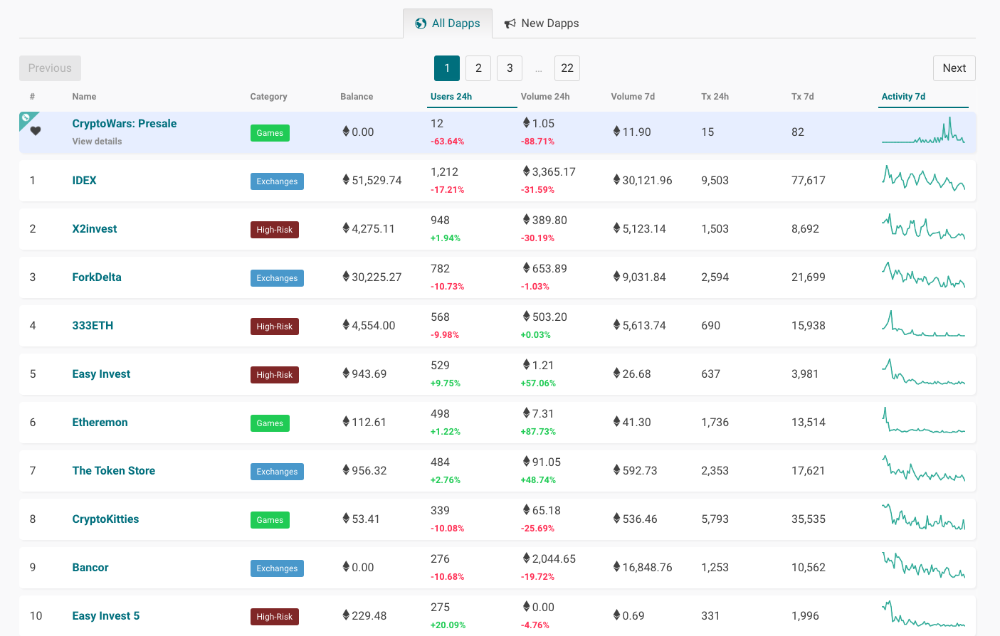

# 介紹

### 什麼是 DApp?

`DApp` 的全名是 `Decentralized Application` (去中心化應用程式)，區塊鏈具有去中心化的概念，所以建構在區塊鏈上的應用程式，就叫 DApp。那它跟一般 App 有什麼差別？首先我們得知道什麼是去中心化，在 `Web 2.0` 的時候都是屬於「中心化」的服務，管理者有絕對的權威，他可以在神不知鬼不覺的情況下，更改背後邏輯，甚至無理由的把一篇文章下架。

`Web 3.0` 廣義上來說，就是有別於 `Web 2.0` 層級技術的一大耀進，例如是人工智慧、VR、DApp、區塊鏈等等。當智能合約發佈後，程式被寫入區塊鏈中，邏輯不能再被更動，即使你是發佈的人也一樣，你可能會想說：「我還是可以把權限管理寫在智能合約裡。」

在去中心化的世界裡，那些權限範圍不會被無限制的延伸，大家都可以查看你的程式碼邏輯。那不要公佈智能合約的原始碼，就解決了嗎？既然都是去中心化應用程式了，你卻刻意的隱藏程式邏輯，大家就可以合理懷疑你寫的程式邏輯有鬼，是不是一個不平等的智能合約，進而抵制它。

## 大綱

這次主題會著重於使用 web3.js 做 DApp 開發，主要會分成三部分：

### 介紹 web3.js

* 什麼是 web3.js
* web3.js 的常用函示及使用情境
  * new Web3
  * web3.eth.getBalance
  * etc...

### 實際寫一些 DApp 範例

* 以太幣帳戶餘額查詢工具
* 簡易版 King of the Ether
* faucet 平台
* 線上轉帳
* 投票系統
* 信託系統
* etc...

### 介紹網路上流行的 DApp

* 目前熱門的 Dapp
* 最近剛發行的 Dapp
* Dapp 發展趨勢

**前十名熱門 Dapp**

資料來源 [DappRadar](https://dappradar.com/) 網站，圖片擷取日期為 2018 年 10 月。

> 想了解智能合約開發的部分，請訂閱我的另一個主題 [Smart Contract 開發 - 使用 Solidity](https://ithelp.ithome.com.tw/articles/10200395)。

### 目錄

* [Day01：介紹](https://ithelp.ithome.com.tw/articles/10201870)
* [Day02：什麼是 web3.js](https://ithelp.ithome.com.tw/articles/10202409)
* [Day03：介紹 Infura](https://ithelp.ithome.com.tw/articles/10202794)
* [Day04：前端輕量化模組](https://ithelp.ithome.com.tw/articles/10203211)
* [Day05：web3.js 初始化](https://ithelp.ithome.com.tw/articles/10203431)
* [Day06：實戰練習「查詢帳戶餘額 with infura」](https://ithelp.ithome.com.tw/articles/10203805)
* [Day07：實戰練習 「查詢帳戶餘額 with MetaMask](https://ithelp.ithome.com.tw/articles/10203977)
* [Day08：實戰練習 「簡易版 King of the Ether (1/3)」](https://ithelp.ithome.com.tw/articles/10204490)
* [Day09：介紹 web3.eth.Contract 建立合約實例與預設配置](https://ithelp.ithome.com.tw/articles/10204775)
* [Day10：實戰練習 「簡易版 King of the Ether (2/3)」](https://ithelp.ithome.com.tw/articles/10204942)
* [Day11：實戰練習 「簡易版 King of the Ether (3/3)」](https://ithelp.ithome.com.tw/articles/10205279)
* [Day12：介紹 web3.eth.Contract - Methods](https://ithelp.ithome.com.tw/articles/10205757)
* [Day13：介紹 web3.eth.Contract 事件](https://ithelp.ithome.com.tw/articles/10206097)
* [Day14：常用網路與工具函示](https://ithelp.ithome.com.tw/articles/10206408)
* [Day15：實戰練習「Rinkeby Faucet」](https://ithelp.ithome.com.tw/articles/10206580)
* [Day16：DApp 應用分析 (1/3)](https://ithelp.ithome.com.tw/articles/10207053)
* [Day17：DApp 應用分析 (2/3)](https://ithelp.ithome.com.tw/articles/10207349)
* [Day18：DApp 應用分析 (3/3)](https://ithelp.ithome.com.tw/articles/10207563)
* [Day19：DApp 開發框架](https://ithelp.ithome.com.tw/articles/10207743)
* [Day20：使用 Truffle 框架在測試環境發佈智能合約](https://ithelp.ithome.com.tw/articles/10207926)
* [Day21：在 Truffle 上除錯](https://ithelp.ithome.com.tw/articles/10208293)