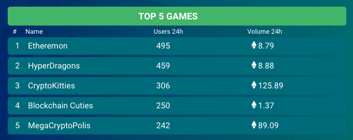

# 介紹

這次主題會著重於使用 `web3.js` 做 `DApp` 開發，至於智能合約開發的部分，請訂閱我的另一個主題[Smart Contract 開發 - 使用 Solidity](https://ithelp.ithome.com.tw/articles/10200395)，不要跑錯棚囉。

主要會分成三部分：

1. 介紹 `web3.js` 實用函式。
2. 實際寫一些 `DApp`
3. 透過解析網路上流行的 `DApp`，從中找出經典模式。

資料來源：<https://dappradar.com/>

### 什麼是 DApp?

`DApp` 的全名是 `Decentralized Application` (去中心化應用程式)，區塊鏈具有去中心化的概念，所以架構在區塊鏈的應用程式，就叫 `DApp`。那它跟一般 `App` 有什麼差別？首先我們得知道什麼是去中心化，在 `Web 2.0` 的時候，管理者有絕對的權威，他可以在神不知鬼不覺的情況下，更改背後邏輯，甚至無理由的把一篇文章下架。

在去中心化的世界裡，目標是要打造的是更平等的世界，迎接是 `Web 3.0` 世界的來臨，當智能合約發佈後，程式被寫入區塊鏈中，邏輯不能再被更動，即使你是發佈的人也一樣，你可能會想說：「我還是可以把權限管理寫在智能合約裡。」

但那些權限範圍不會被無限制的延伸，而且大家都可以查看你的程式碼邏輯，你可能會想說：「那我就不要公佈我智能合約的原始碼。」既然都是去中心化應用程式了，你卻刻意的隱藏程式邏輯，大家就可以合理懷疑你寫的程式邏輯有鬼，是不是一個不平等的智能合約，進而抵制它。