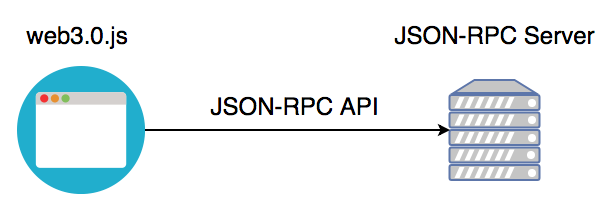

# 什麼是 web3.js

它是一個函式庫，把以太坊的 `JSON-RPC API` 重新封裝過，並添加一下實用的函式庫，常用於 `Dapp` 網站的前端部分。它不像 `Geth` 或 `Parity` 本身就具有 `JSON-RPC Server` 的功能，它必須要倚賴其他 `JSON-RPC Server` 跟以太坊區塊鏈溝通。



**四大模組**

* web3.eth：與以太坊相關的函示
  * web3.eth.subscribe
  * web3.eth.Contract 與智能合約互動
  * web3.eth.accounts 與帳戶相關的函示
  * web3.eth.personal
  * web3.eth.ens：與 ENS 互動的函示
  * web3.eth.Iban
  * web3.eth.abi
* web3.shh：與 [whisper](https://github.com/ethereum/wiki/wiki/Whisper-Overview) 有關的函示
* web3.bzz：與 `swarm` 互動的函示
* web3.utils：輔助函示
  
**ENS**

* 全名 Ethereum Name Service
* 官網：<https://ens.domains/>
* 文件：<http://docs.ens.domains/en/latest/>

**Swarm**

* 分散式的儲存平台和內容傳遞服務
* 文件：<https://swarm-guide.readthedocs.io/en/latest/>

#### Promise

Web3.js 從 1.0 開始支援 [Promise](https://developer.mozilla.org/zh-TW/docs/Web/JavaScript/Reference/Global_Objects/Promise)，API 有分成同步和非同步的呼叫，非同步呼叫採用的是 `Error-First Callback` 的方式。

`Error-First Callback` 指的是，一律假定函示的第一個參數值是 Error 物件。

```js
const address = '0x06012c8cf97BEaD5deAe237070F9587f8E7A266d';
web3.eth.getBalance(address, (err, balance) => {
  if(err) return;
  console.log(balance);
});
```

### 小結

以太坊有非常多的 Open Source 專案，一不小心就會迷路，現在你應該瞭解了 `web3.js` 在整個生態系的位置。