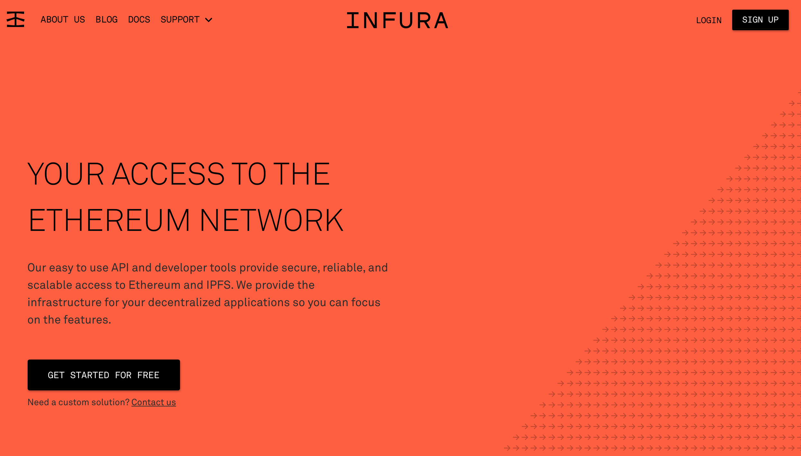
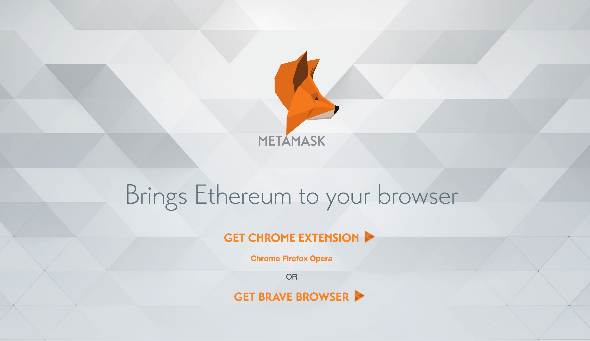

# 什麼是 web3.js

它是一個函式庫，把以太坊的 `JSON-RPC API` 重新封裝過，並添加一下實用的函式庫，常用於 `Dapp` 網站的前端部分。它不像 `Geth` 或 `Parity` 本身就具有 `JSON-RPC Server` 的功能，它必須要倚賴其他 `JSON-RPC Server` 跟以太坊區塊鏈溝通。

**四大模組：**

* web3-eth：與以太坊的智能合約函示
* web3-shh：與 [whisper](https://github.com/ethereum/wiki/wiki/Whisper-Overview) 有關的函示
* The web3-bzz：與 swarm 有關的函示
* web3-utils：有助於 DApp 開發的輔助函示

> 1.0 開始支援 [Promise](https://developer.mozilla.org/zh-TW/docs/Web/JavaScript/Reference/Global_Objects/Promise)

### 準備環境

我們剛剛有提到，`web3.js` 必須要搭配一個 Server 使用，如果只打算接觸前端 DApp 開發，可以直接註冊 [infura](<https://infura.io/>)，馬上就有專屬於你的連接位置，也可以考慮使用 [MetaMask](https://metamask.io/)，兩者選一個就可以了。

### 小結

以太坊有非常多的 Open Source 專案，一不小心就會迷路，現在你應該瞭解了 `web3.js` 在整個生態系的位置。