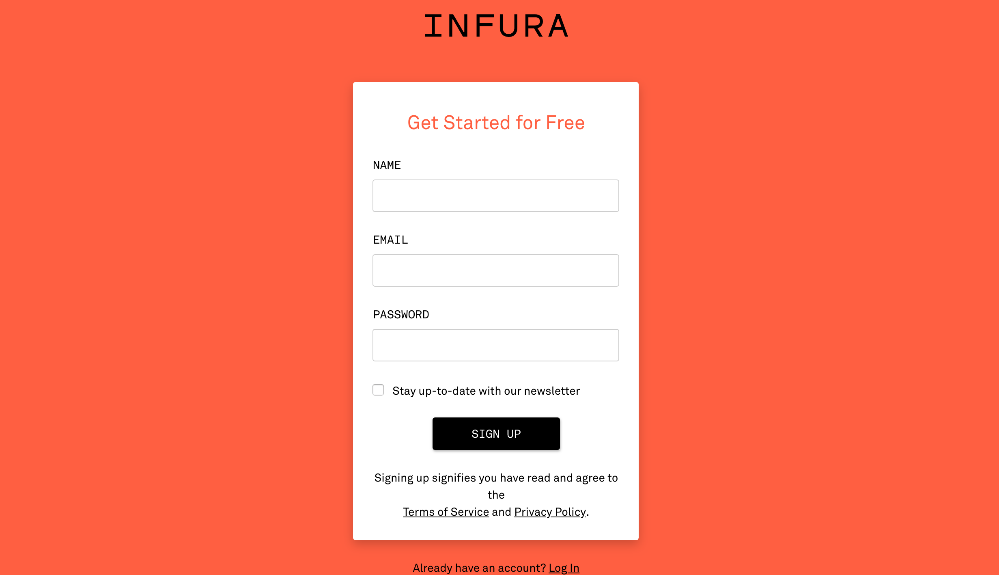
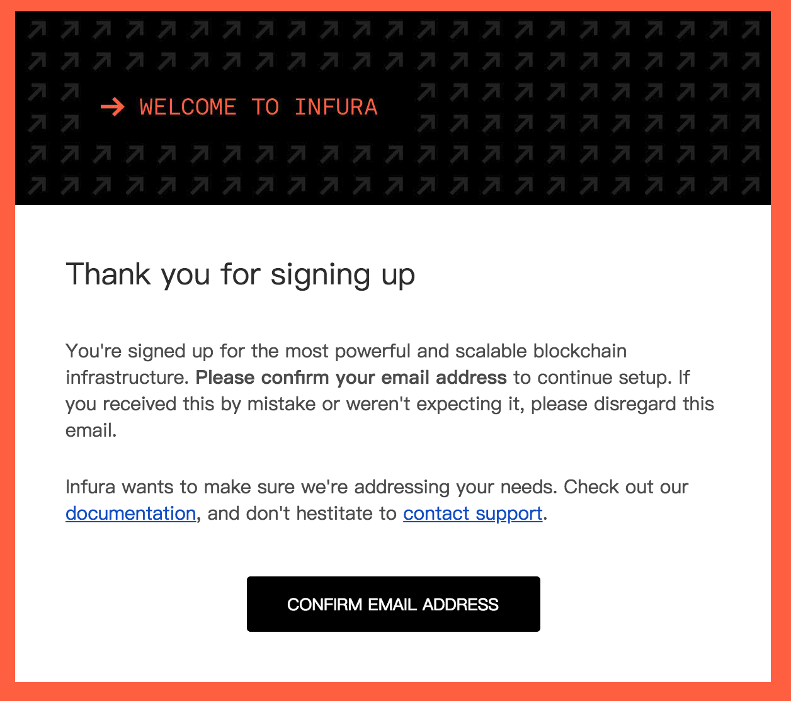
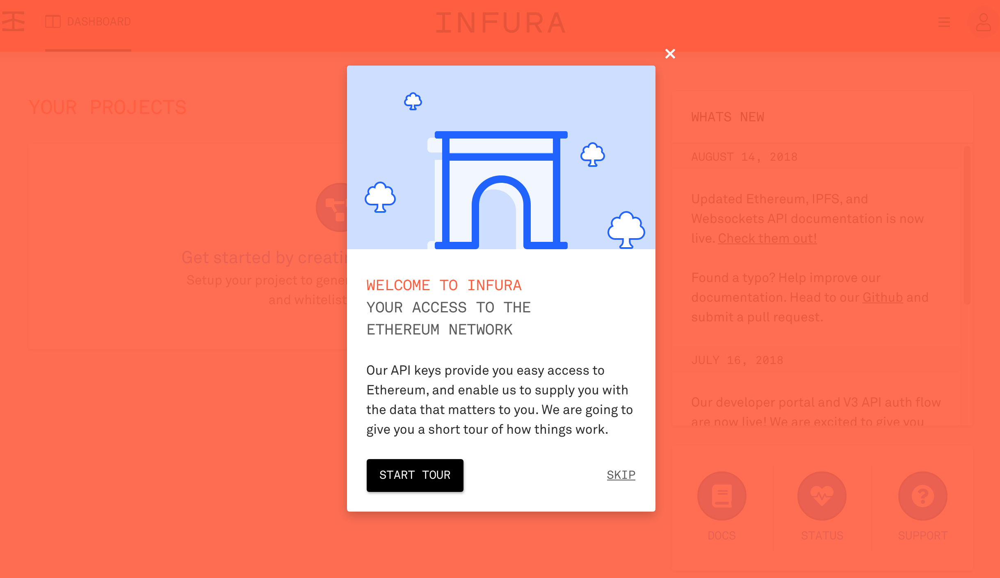
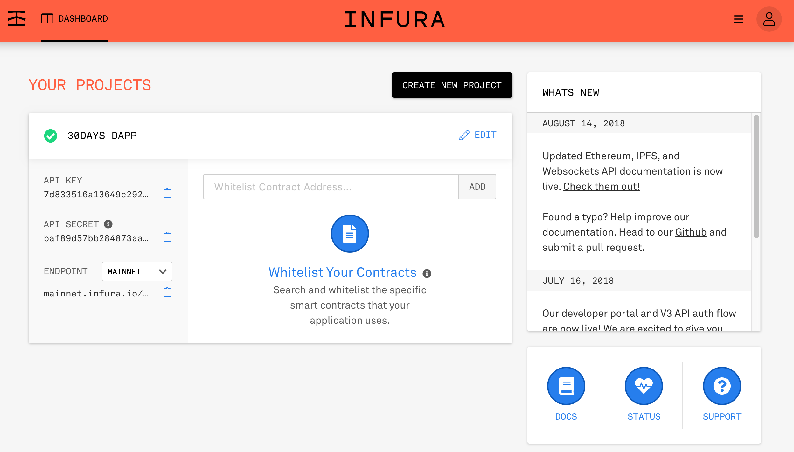

# 介紹 Infura

前一篇我們有提到，`web3.js` 必須要搭配一個 `JSON-RPC Server` 來使用，如果只打算接觸前端 DApp 開發，可以直接註冊 [infura](<https://infura.io/>)，馬上就有專屬於你的連接位置。

除此之外，你也可以考慮使用 [MetaMask](https://metamask.io/)，兩者選一個就可以了。

**Infura 是什麼？**

它提供擴充性高的區塊鏈基礎建設，一個簡單容易使用的開發人員工具，提供安全、可靠、擴充性高的存取以太坊和 `IPFS`。讓你省去基礎建設的煩惱，更專注在開發 DApp。

**Infura 的好處**

讓你省去自己建立和管理以太坊客戶端

### 註冊 Infura 帳號

**步驟一**：先前往首頁 <https://infura.io/>，然後按首頁右上角的 `SIGN UP` 按鈕，前往註冊頁面。

**步驟二**：填入名字、電子郵件、密碼後，按 `SIGN UP` 按鈕，等待前往下一個頁面。

**步驟三**：註冊成功後，Infura 會發送一個電子信箱驗證信，如果你沒有收到，可以按 `RE-SEND VERIFICATION EMAIL` 按鈕，Infura 會重新寄一封驗證信給你。

**步驟四**：這封就是你的驗證信了，請按下 `CONFIRM EMAIL ADDRESS` 按鈕來完成這個驗證步驟。

**步驟五**：當你看到這個畫面時，就代表你整個註冊流程都結束了。你可以按 `START TOUR` 按鈕來看它提供的使用教學，或者直接按 `SKIP` 跳過觀看教學的部分。

### 建立一個專案

**步驟一**：首先按一下 `CREATE NEW PROJECT` 按鈕來建立一個新的專案。

**步驟二**：輸入要命名的專案名稱，並按下 `CREATE PROJECT` 按鈕。

**步驟三**：這時你就可以取得 `API KEY`、`API SECRET` 和 `ENDPOINT`，這裡的 `ENDPOINT` 就是 `JSON-RPC API` 的進入點。

### 小結

接下來，我們將用 `Infura` 來做  `web3.js` 的初始化，以及取得帳戶餘額資訊。
