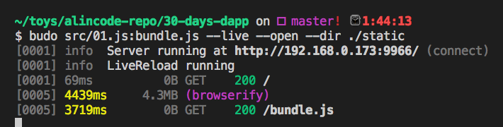

# 前端輕量化模組

雖然現在 `Vue.js`、`React.js`、`Angular.js`、`JQuery` 已經很普及，但我不想預設讀者已經會使用這些框架，為了維持範例簡單清晰，採用以下這些輕量化模組，大家只要花 3 分鐘閱讀，即可上手。

* nanohtml
* morphdom
* csjs-inject
* budo
* browserify

### nanohtml

它是一個輕量級的 view engine，以前的名稱叫 `bel`，但現在改名為 `nanohtml`。

專案網址：<https://github.com/choojs/nanohtml>

**新增一個元素**

```js
const html = require('nanohtml');
const element = html`<div>Hello!</div>`;
document.body.appendChild(element);
```

**建立多個元素**

```js
const html = require('nanohtml');

const users = ['ALin', 'John', 'Tom'];
var element = html`<ul>
  ${users.map(function (uesr) {
    return html`<li>${user}</li>`
  })}
</ul>`

document.body.appendChild(element)
```

**新增事件**

```js
function hi(event) { alert('Hello'); }

var button = bel`<button class="primary" onclick=${hi}>click me</button>`
```

**元素裡面，還有其他元素**

```js
const html = require('nanohtml');

function welcomPanel(name) {
  return html`<div>Hi, ${name}</div>`
}

document.body.appendChild(html`
  <div>
    ${welcomePanel("alincode")}
  </div>
`);
```

**搭配其他模組化元件**


```js
const btn = require('button-styles');
const html = require('nanohtml');

const primary = html`<button class="${btn.primary}">Primary</button>`
const warning = html`<button class="${btn.warning}">Warning</button>`
const danger = html`<button class="${btn.danger}">Danger</button>`
```

想瞭解更多可以前往：<https://github.com/choojs/nanohtml/wiki/Elements-On-npm>


### morphdom

快速更新 DOM 的工具型模組，可與 `nanohtml` 搭配使用。

專案網址：<https://github.com/patrick-steele-idem/morphdom>


**更新元素**

```js
const html = require('nanohtml');
const morphdom = require('morphdom');

const element = html`<div>hello</div>`;
const newElement = html`<div>Hi</div>`;

morphdom(element, newElement)
```

### csjs-inject

它把 `CSJS` 模組重新包過，功能跟 `CSJS` 一樣，但使用起來比較簡便，可以將 CSS 注入到 DOM 中。

專案網址：<https://github.com/rtsao/csjs-inject>

```js
const css = csjs `
  .input {
    margin-top: 10px;
    margin-right: 10px;
    width: 500px;
    font-size: 20px;
  }
`

const inputName = html `<input class=${css.input} type="text" placeholder="input your name"/>`;
```

### budo

* <https://github.com/mattdesl/budo>
* 它是一個 browserify 開發用伺服器，專注於 Live reload (包括 CSS injection）和其他用於快速原型設計的功能。
* 常用參數
  * --open：開啟瀏覽器，預設 port 為 9966
  * --live：啟動 LiveReload 模式，當 HTML、Javascript、CSS 有變動的時候自動更新頁面。
  * --dir：指定公開的目錄 (public directory)

```sh
// 安裝 budo
npm install budo -g

// 開發用 live reload 模式
budo src/01.js:bundle.js --live --open --dir ./static
```



### browserify


模塊打包工具，可以讓瀏覽器使用 `require` 語法。

官網：<http://browserify.org/>

```sh
// 安裝 
npm install browserify -g

// 打包
browserify src/01.js > static/01.js
```

非必要，如果你沒打算發佈到網路上的話，可以只用 live reload 模式，可以不安裝 browserify。