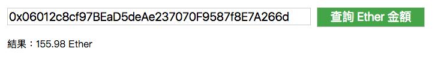
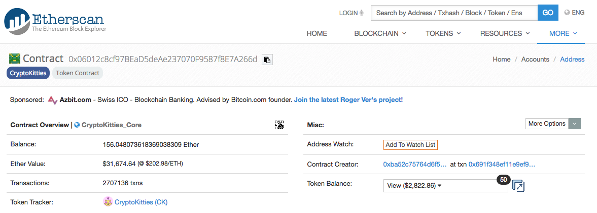

# web3.js 初始化與查詢帳戶餘額 DApp 範例

#### 安裝 web3.js

方法一：使用 `NPM` 來安裝 `web3.js`

```
npm install --save web3
```

方法二：使用 CDN

```html
<script src="https://cdn.jsdelivr.net/gh/ethereum/web3.js/dist/web3.min.js"></script>
```

方法三：從 [Github 下載](https://github.com/ethereum/web3.js) 打包好的`dist/web3.min.js` 檔案。

#### provider (供應者)

指向你要連接的 `JSON-RPC Server` 位置

**為 web3 初始化 provider**

```js
// 引入模組
const Web3 = require('web3');

// HTTP provider
const web3 = new Web3(new Web3.providers.HttpProvider('http://localhost:8545'));

// Socket provider
const web3 = new Web3(new Web3.providers.WebsocketProvider('ws://localhost:8546'));

// IPC provider
const net = require('net');
const web3 = new Web3(new Web3.providers.IpcProvider('/Users/myuser/Library/Ethereum/geth.ipc', net));
```

**更換 provider**

```js
web3.setProvider(new Web3.providers.HttpProvider('http://localhost:8545'));
web3.setProvider(new Web3.providers.WebsocketProvider('ws://localhost:8546'));
web3.setProvider(new Web3.providers.IpcProvider('/Users/myuser/Library/Ethereum/geth.ipc', net));
```

**currentProvider**

常與 `MetaMask` 搭配使用

```js
const web3 = new Web3(web3.currentProvider);
```

## 實戰練習：查詢帳戶餘額 DApp

<https://alincode.github.io/30-days-dapp/static/01.html>



對照 etherscan：<https://etherscan.io/address/0x06012c8cf97BEaD5deAe237070F9587f8E7A266d>



### 範例

static/index.html

```html
<!doctype html>
<html>
<head>
  <meta charset="utf-8">
</head>
<body>
  <script src="bundle.js"></script>
</body>
</html>
```

```js
// src/01.js
const Web3 = require('web3');
const html = require('nanohtml');
const csjs = require('csjs-inject');
const morphdom = require('morphdom');

const INFURA_API_KEY = 'your_infura_api_key';
const web3 = new Web3(Web3.givenProvider || `https://mainnet.infura.io/v3/${INFURA_API_KEY}`);

const css = csjs `
  .box {
  }
  .input {
    margin: 10px;
    width: 500px;
    font-size: 20px;
  }
  .button {
    margin-top: 10px;
    font-size: 20px;
    width: 180px;
    background-color: #4CAF50;
    color: white;
  }
  .result {
    margin: 10px;
  }
  img {
    border: 1px solid #ddd;
    border-radius: 4px;
    padding: 5px;
    width: 150px;
  }
`

const address = '0x06012c8cf97BEaD5deAe237070F9587f8E7A266d';

// ==== DOM element ===

const inputAccount = html `<input class=${css.input} type="text" value=${address} placeholder="輸入你要查詢的帳戶"/>`;
const resultElement = html `<div></div>`

// ===== Event =====

function queryBalance(event) {
  web3.eth.getBalance(inputAccount.value, (err, balance) => {
    let number = Math.round(web3.utils.fromWei(balance, 'ether') * 100) / 100;
    const newElement = html `<div class="${css.result}">結果：${number} Ether</div>`
    morphdom(resultElement, newElement);
  });
}

function render() {
  document.body.appendChild(html `
  <div class=${css.box} id="app">
    ${inputAccount}
    <button class=${css.button} onclick=${queryBalance}>查詢 Ether 金額</button>
    ${resultElement}
  </div>
 `)
}

render();
```