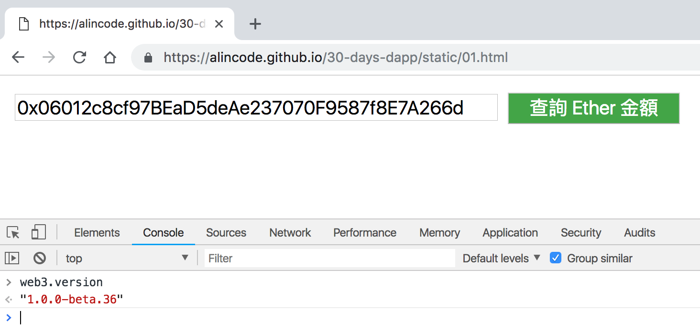

# web3.js 初始化

本系列文章用的是 `1.0.0-beta.36` 版，你可以透過以下指令查詢 `web3.js` 的版本。

```
web3.version
```

如果你有安裝 `MetaMask` 或位在 `DApp` 網頁，可以直接開啟瀏覽器的「開發人員工具」試試看。



### 安裝 web3.js

方法一：使用 `NPM` 來安裝 `web3.js`

```
npm install --save web3
```

方法二：使用 CDN

```html
<script src="https://cdn.jsdelivr.net/gh/ethereum/web3.js/dist/web3.min.js"></script>
```

方法三：從 [Github 下載](https://github.com/ethereum/web3.js) 打包好的`dist/web3.min.js` 檔案。

### provider

指向你要連接的 `JSON-RPC Server` 位置

**為 web3 初始化 provider**

```js
// 引入模組
const Web3 = require('web3');

// HTTP provider
const web3 = new Web3(new Web3.providers.HttpProvider('http://localhost:8545'));

// Socket provider
const web3 = new Web3(new Web3.providers.WebsocketProvider('ws://localhost:8546'));

// IPC provider
const net = require('net');
const web3 = new Web3(new Web3.providers.IpcProvider('/Users/myuser/Library/Ethereum/geth.ipc', net));
```

**更換 provider**

```js
web3.setProvider(new Web3.providers.HttpProvider('http://localhost:8545'));
web3.setProvider(new Web3.providers.WebsocketProvider('ws://localhost:8546'));
web3.setProvider(new Web3.providers.IpcProvider('/Users/myuser/Library/Ethereum/geth.ipc', net));
```

**currentProvider**

常與 `MetaMask` 搭配使用

```js
web3 = new Web3(web3.currentProvider);
```

### 常見用法

```js
if (typeof web3 !== 'undefined') {
  web3 = new Web3(web3.currentProvider);
} else {
  const INFURA_API_KEY = 'your_infura_api_key';
  web3 = new Web3(`https://mainnet.infura.io/v3/${INFURA_API_KEY}`);
}
```