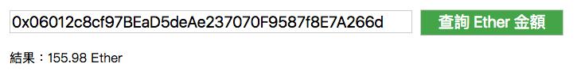
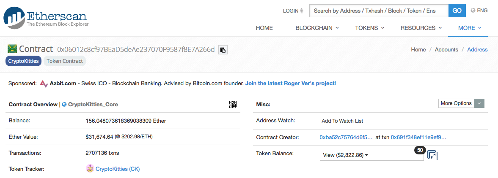

# 實戰練習：查詢帳戶餘額 with infura

**web3.eth.getBalance**

查詢餘額

語法
```js
web3.eth.getBalance(address [, defaultBlock] [, callback])
```

傳入值
* address：帳號
* defaultBlock：區塊編號

回傳值
* balance: 餘額

範例
```js
const address = '0x06012c8cf97BEaD5deAe237070F9587f8E7A266d';
web3.eth.getBalance(address, (err, balance) => {
  
});
```

### Demo



<https://alincode.github.io/30-days-dapp/static/01.html>



對照 etherscan：<https://etherscan.io/address/0x06012c8cf97BEaD5deAe237070F9587f8E7A266d>

### 原始碼

static/01.html

```html
<!doctype html>
<html>
<head>
  <meta charset="utf-8">
</head>
<body>
  <script src="01.js"></script>
</body>
</html>
```

src/01.js

```js
// 匯入模組
const Web3 = require('web3');
const html = require('nanohtml');
const csjs = require('csjs-inject');
const morphdom = require('morphdom');

// 初始化 web3.js
const INFURA_API_KEY = 'your_infura_api_key';
web3 = new Web3(`https://mainnet.infura.io/v3/${INFURA_API_KEY}`);

// 設定 css inject
const css = csjs `
  .box {
  }
  .input {
    margin: 10px;
    width: 500px;
    font-size: 20px;
  }
  .button {
    margin-top: 10px;
    font-size: 20px;
    width: 180px;
    background-color: #4CAF50;
    color: white;
  }
  .result {
    margin: 10px;
  }
  img {
    border: 1px solid #ddd;
    border-radius: 4px;
    padding: 5px;
    width: 150px;
  }
`

const address = '0x06012c8cf97BEaD5deAe237070F9587f8E7A266d';

// ==== DOM element ===

const inputAccount = html `<input class=${css.input} type="text" value=${address} placeholder="輸入你要查詢的帳戶"/>`;
const resultElement = html `<div></div>`

// ===== Event =====

function queryBalance(event) {
  web3.eth.getBalance(inputAccount.value, (err, balance) => {
    let number = Math.round(web3.utils.fromWei(balance, 'ether') * 100) / 100;
    const newElement = html `<div class="${css.result}">結果：${number} Ether</div>`
    morphdom(resultElement, newElement);
  });
}

// ===== render ===== 

function render() {
  document.body.appendChild(html `
  <div class=${css.box} id="app">
    ${inputAccount}
    <button class=${css.button} onclick=${queryBalance}>查詢 Ether 金額</button>
    ${resultElement}
  </div>
 `)
}

render();
```