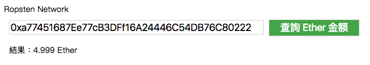

# 實戰練習：查詢帳戶餘額 with MetaMask

**web3.eth.getAccounts**

取得帳號列表

語法
```js
web3.eth.getAccounts([callback])
```

回傳值
* addresses: address 陣列

範例
```js
web3.eth.getAccounts(function(err, addresses){

});
```

**web3.eth.defaultAccount**

如果以下的函示沒有給 `from` 參數值，這個設定的值，將會成為 `from` 的預設值。

* web3.eth.sendTransaction()
* web3.eth.call()
* new web3.eth.Contract() -> myContract.methods.myMethod().call()
* new web3.eth.Contract() -> myContract.methods.myMethod().send()

範例
```js
// 取得預設帳號
web3.eth.defaultAccount;

// 設定預設帳號
web3.eth.defaultAccount = '0x11f4d0A3c12e86B4b5F39B213F7E19D048276DAe';
```

**web3.eth.net.getId**

取得以太坊網路編號

```
1: 主網
3: Ropsten
42: Kovan
4: Rinkeby
````

範例
```js
web3.eth.net.getId(function (err, networkId) {

});
```

### Demo



<https://alincode.github.io/30-days-dapp/static/02.html>

### 原始碼

static/02.html

```html
<!doctype html>
<html>
<head>
  <meta charset="utf-8">
</head>
<body>
  <script src="01.js"></script>
</body>
</html>
```

src/02.js

```js
const Web3 = require('web3');
const html = require('nanohtml');
const csjs = require('csjs-inject');
const morphdom = require('morphdom');

if (typeof web3 !== 'undefined') {
  web3 = new Web3(web3.currentProvider);
} else {
  alert('initial failed');
}

const css = csjs `
  .box {
  }
  .input {
    margin: 10px;
    width: 500px;
    font-size: 20px;
  }
  .button {
    margin-top: 10px;
    font-size: 20px;
    width: 180px;
    background-color: #4CAF50;
    color: white;
  }
  .result {
    margin: 10px;
  }
  img {
    border: 1px solid #ddd;
    border-radius: 4px;
    padding: 5px;
    width: 150px;
  }
`

// ==== DOM element ===

const resultElement = html `<div></div>`
const inputAccount = html `<input class=${css.input} type="text" value="" placeholder="輸入你要查詢的帳戶"/>`;

// ===== utils =====
function getNetworkName(networkId) {
  if (networkId == 1) return "Main";
  else if (networkId == 3) return "Ropsten";
  else if (networkId == 42) return "Kovan";
  else if (networkId == 4) return "Rinkeby";
  else return "";
}

// ===== Event =====

function queryBalance(event) {
  web3.eth.getBalance(inputAccount.value, (err, balance) => {
    let number = Math.round(web3.utils.fromWei(balance, 'ether') * 1000) / 1000;
    const newElement = html `<div class="${css.result}">結果：${number} Ether</div>`
    morphdom(resultElement, newElement);
  });
}

// ===== Preload =====

function start() {
  console.log('=== start ===');
  getNetworkId({});
}

function getNetworkId(result) {
  console.log('>>> 1');
  web3.eth.net.getId(function (err, networkId) {
    result.networkId = networkId;
    getAccounts(result);
  });
}

function getAccounts(result) {
  console.log('>>> 2');
  web3.eth.getAccounts(function (err, addresses) {
    const address = addresses[0];
    web3.eth.defaultAccount = address;
    result.account = address;
    render(result);
  });
}

function render(result) {
  console.log('>>> result:', result);
  document.body.appendChild(html `
  <div class=${css.box} id="app">
    ${getNetworkName(result.networkId)} Network<br>
    ${inputAccount}
    <button class=${css.button} onclick=${queryBalance}>查詢 Ether 金額</button>
    ${resultElement}
  </div>
 `)
}

if (typeof web3 !== 'undefined') start();
```