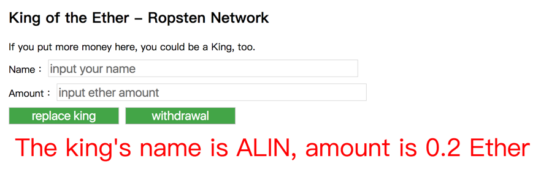

# 實戰練習：簡化版 King of the Ether (1/3)

不知道大家有名有聽過 [King of the Ether](https://www.kingoftheether.com/thrones/kingoftheether/index.html)，這是一套之前小有名氣的 Dapp 遊戲，我把邏輯簡化一點來當作這次要實作的練習題。

**遊戲邏輯**

1. 出最多錢的人，可以當王，當王的人可以顯示自己的名字在頁面上。
1. 活動結束之前，每個人都可以篡位，每次篡位需要花比對方多 0.1 ETH 的錢。
1. 被篡位的人，可以拿走篡位的人的錢，但要先扣除管理費。
1. 每次 owner 會抽，0.05 ETH 當管理費，活動結束之後，owner 可以提領這筆錢。

**依照九個步驟來實作 Dapp**

step1: 匯入模組
step2: 初始化 web3.js
step3: 連接智能合約
step4: 宣告 CSS inject 物件
step5: 建立 DOM 元素
step6: 監聽智能合約事件
step7: 實作 DOM 事件
step8: 預載資料
step9: render html
