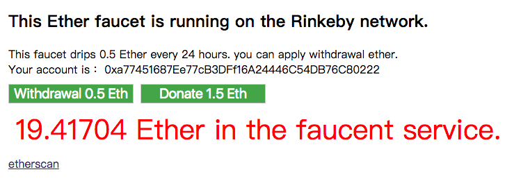

# 實戰練習：Rinkeby Faucet

* Demo: <https://alincode.github.io/rinkeby-faucet/>
* Github: <https://github.com/alincode/rinkeby-faucet>

**截圖**



**index.html**

```html
<!doctype html>
<html>

  <head>
    <meta charset="utf-8">
  </head>

  <body>
    <script src="app.js"></script>
  </body>

</html>
```

**src/app.js**

```js
const Web3 = require('web3');
const html = require('nanohtml');
const csjs = require('csjs-inject');
const morphdom = require('morphdom');

async function web3Init() {
  if (ethereum) {
    web3 = new Web3(ethereum);
    try {
      await ethereum.enable();
    } catch (error) {}
  } else if (web3) {
    web3 = new Web3(web3.currentProvider);
  } else {
    console.log('Non-Ethereum browser detected. You should consider trying MetaMask!');
  }
}

web3Init();

const DONATE_AMOUNT_ETH = "1.5";
const ABI = require('./abi.json');
const DEFAULT_ADDRESS = '0xeadae604454f71c41253d26a41827ef3860de32f';
const contractAddress = localStorage.constract || DEFAULT_ADDRESS;
myContract = new web3.eth.Contract(ABI, contractAddress);

const css = csjs `
  .box {
    margin: 10px;
  }
  .input {
    margin-top: 10px;
    margin-right: 10px;
    width: 500px;
    font-size: 20px;
  }
  .button {
    margin-top: 10px;
    margin-right: 10px;
    font-size: 20px;
    width: 180px;
    background-color: #4CAF50;
    color: white;
  }
  .result {
    padding: 10px;
    font-size: 40px;
    color: red;
  }
  img {
    border: 1px solid #ddd;
    border-radius: 4px;
    padding: 5px;
    width: 150px;
  }
`

// ===== DOM element =====

const resultElement = html `<div></div>`
const inputName = html `<input class=${css.input} type="text" placeholder="input your name"/>`;
const inputAmount = html `<input class=${css.input} type="number" placeholder="input ether amount"/>`;

// ===== utils =====
function getNetworkName(networkId) {
  if (networkId == 1) return "Main";
  else if (networkId == 3) return "Ropsten";
  else if (networkId == 42) return "Kovan";
  else if (networkId == 4) return "Rinkeby";
  else return "";
}

function updateBalanceElement(data) {
  const ether = web3.utils.fromWei(data, "ether");
  const newElement = html `<div class="${css.result}">${ether} Ether in the faucent service.</div>`
  morphdom(resultElement, newElement);
}

// ===== listening smart contract event =====

// Generate filter options
const options = {
  // filter: {
  //   _from: process.env.WALLET_FROM,
  //   _to: process.env.WALLET_TO,
  //   _value: process.env.AMOUNT
  // },
  fromBlock: 'latest'
}

myContract.events.UserDonate(options, async (error, event) => {
  if (error) {
    console.log(error)
    return
  }
  console.log('UserDonate: ', event.returnValues);
  updateBalanceElement(event.returnValues.balance);
  return
})

myContract.events.UserWithdrawal(options, async (error, event) => {
  if (error) {
    console.log(error)
    return
  }
  console.log('UserWithdrawal: ', event.returnValues);
  updateBalanceElement(event.returnValues.balance);
  return
})

// ===== Click Event =====

function donate(event) {
  let account = web3.eth.defaultAccount;
  console.log('account: ', account);
  myContract.methods.donate().send({
    from: account,
    value: web3.utils.toWei(DONATE_AMOUNT_ETH, "ether")
  }, (err, data) => {
    if (err) return console.error(err);
    console.log('>>> donate ok.');
  });
}

function withdrawal(event) {
  let account = web3.eth.defaultAccount;
  myContract.methods.withdrawal().send({
    from: account
  }, (err, data) => {
    if (err) return console.error(err);
    console.log('>>> withdrawal ok.');
  });
}

// ===== Preload =====

function start() {
  console.log('=== start ===');
  getNetworkId({});
}

function getNetworkId(result) {
  console.log('>>> 1');
  web3.eth.net.getId(function (err, networkId) {
    if (networkId != 4) {
      alert('It only support Rinkeby network!');
    }
    result.networkId = networkId;
    getAccounts(result);
  });
}

function getAccounts(result) {
  console.log('>>> 2');
  web3.eth.getAccounts(function (err, addresses) {
    if (!addresses[0]) alert('please install or login your metamask.');
    const address = addresses[0];
    web3.eth.defaultAccount = address;
    result.account = address;
    withdrawalAmount(result);
  });
}

function withdrawalAmount(result) {
  console.log('>>> 3');
  myContract.methods.withdrawalAmount().call((err, data) => {
    if (err) return console.error(err);
    const ether = web3.utils.fromWei(data, "ether");
    result.withdrawalAmount = ether;
    getBalance(result);
  })
}

function getBalance(result) {
  console.log('>>> 4');
  myContract.methods.getBalance().call((err, data) => {
    if (err) return console.error(err);
    if (data != "0") {
      updateBalanceElement(data);
    }
    render(result);
  })
}

function render(result) {
  console.log('>>> result:', result);
  document.body.appendChild(html `
  <div class=${css.box} id="app">
    <h2>This Ether faucet is running on the ${getNetworkName(result.networkId)} network.</h2>
    <div>This faucet drips ${result.withdrawalAmount} Ether every 24 hours. you can apply withdrawal ether.</div>
    Your account is： ${result.account}<br>
    <button class=${css.button} onclick=${withdrawal}>Withdrawal ${result.withdrawalAmount} Eth</button>
    <button class=${css.button} onclick=${donate}>Donate ${DONATE_AMOUNT_ETH} Eth</button>
    ${resultElement}
    <a href="https://${getNetworkName(result.networkId)}.etherscan.io/address/${contractAddress}">etherscan</a>
  </div>
 `)
}

if (typeof web3 !== 'undefined') start();
```