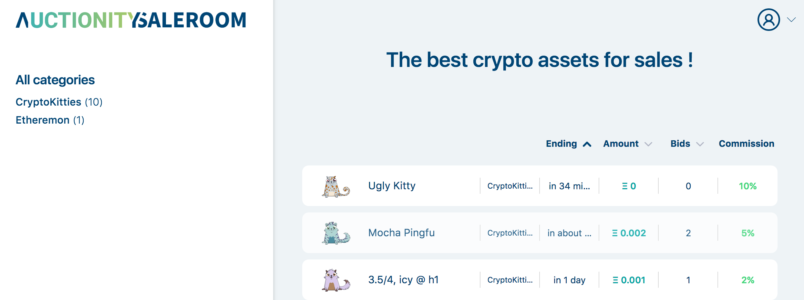
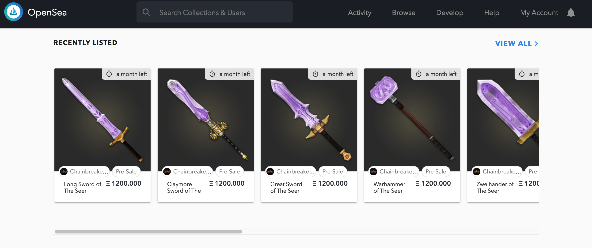

# DApp 應用分析 (2/3)

### 收藏類遊戲 (collectibles)

**Crypt-Oink**

* 網站：<https://www.crypt-oink.io/>
* 可以使用以太幣買賣寵物豬，並可進行配對的模擬遊戲。
* 遊戲規則說明：<https://www.crypt-oink.io/#help_howToPlay_0_0>

**CryptoPepes**

* 網站：<https://cryptopepes.io/>
* 提供 CryptoPepes 的配種、收集、交易、戰鬥

**CryptoPunks**

* 網站：<https://www.larvalabs.com/cryptopunks>
* 提供 1 萬個不重複的人頭圖像讓玩家交易跟收藏
* 使用 ERC-721
* 新聞
  * 金融時報 (2018/06/06) - [CryptoKitties, CryptoPunks and the birth of a cottage industry](https://www.ft.com/content/f9c1422a-47c9-11e8-8c77-ff51caedcde6)
  * 紐約時報 (2018/01/13) - [Will Cryptocurrencies Be the Art Market’s Next Big Thing?](https://www.nytimes.com/2018/01/13/arts/cryptocurrency-art-market.html)

**CryptoAtoms**

* 網站：<https://www.cryptoatoms.org/>
* 收集獨一獨二的原子圖

### 市場類 (marketplaces)

**Auctionity**

* 網站：<https://app.auctionity.com/>
* 拍賣交易市場：可以允許使用者拍賣、競標加密資產 (crypto assets)。

**Decentraland Marketplace**

* 網站：<https://market.decentraland.org/>
* 允許使用者買、賣和管理虛擬土地，然後可以在你賣的土地上透過它提供的函式庫，打照自己理想中的樣子。
* Github：<https://github.com/decentraland/marketplace>

  

**OpenSea**

* 網站：<https://opensea.io/>
* 加密收藏品交易市場，可以客製化自己的市場
* 文件：<https://docs.opensea.io/>

**Rare Bits**

* 網站：<https://rarebits.io/>
* 加密收藏品交易市場，零手續費。