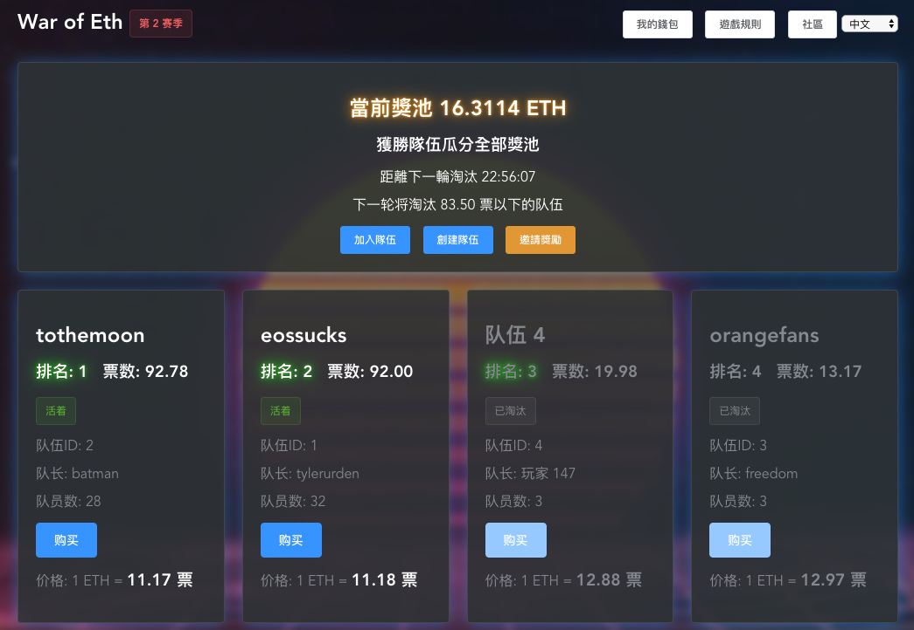
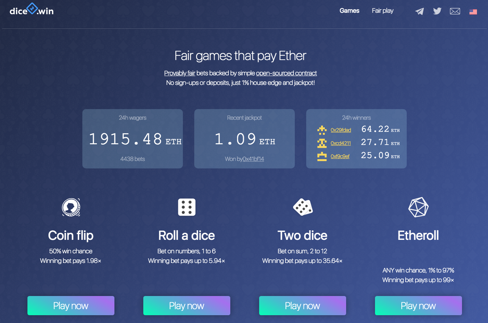
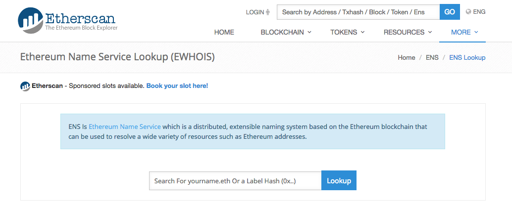

# DApp 應用分析 (3/3)

### 博弈類

**War of Eth**

* 網頁：<http://warofeth.com/>
* 每天都會消除票數較少的球隊，生存到最後的球隊，隊員可以共享獎金。

**dice2.win**

* 網頁：<https://dice2.win/>
* 提供多種博弈遊戲，可以累積獎金，每日下注的交易次數非常多，曾創過一天交易金額達 3,000 個 ETH。
* 白皮書：<https://dice2.win/whitepaper.pdf>
* 智能合約：<https://etherscan.io/address/0xD1CEeeeee83F8bCF3BEDad437202b6154E9F5405#code>
* Twitter：<https://twitter.com/dice2win>
* Github：<https://github.com/dice2-win/contracts>

### 其他類

**Ethereum Name Service**

* 查詢可註冊的名字：<https://registrar.ens.domains/>
* 查詢已註冊的名字資訊：<https://etherscan.io/enslookup>
* 類似 DNS (Domain Name Service)，但不是針對網際網路，而是針對以太坊，可以把位址 (Address) 取一個暱稱，例如 `xxxxx.eth`。
* 延伸閱讀
  * [蓋索林 blog - 收到我的ENS網域啦 gasolin.eth](https://blog.gasolin.idv.tw/2017/08/13/got-my-ens-domain/)

**Augur**

* 網址：<https://www.augur.net/>
* `Augur` 是一個分散的 `oracle` 和預測市場平台
* Twitter：<https://twitter.com/AugurProject>

