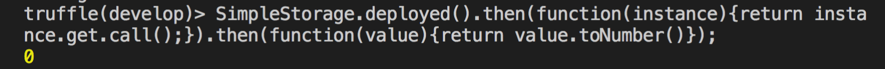

# 透過 Truffle 框架在測試環境發佈智能合約

```sh
# 安裝 truffle
npm install -g truffle

# 建立一個空的資料夾
mkdir simple-storage
cd simple-storage

# 初始化專案
truffle init
```

初始化後，你可以看到三個資料夾

* contracts 目錄：存放智能合約原始碼的資料夾
* migrations 目錄：存放發佈合約的 script
* test 目錄：存放測試 script 的原始碼

**四個檔案**

* contracts/Migrations.sol
* migrations/1_initial_migration.js
* truffle-config.js
* truffle.js：truffle 設定檔

**新增智能合約**

```js
// contracts/Store.sol
pragma solidity ^0.4.17;

contract SimpleStorage {
  uint myVariable;

  function set(uint x) public {
    myVariable = x;
  }

  function get() constant public returns (uint) {
    return myVariable;
  }
}
```

**新增部署的 script**

```js
// migrations/2_deploy_contracts.js
var SimpleStorage = artifacts.require("SimpleStorage");

module.exports = function (deployer) {
  deployer.deploy(SimpleStorage);
};
```

```sh
# 編譯智能合約
truffle compile

# 啟動 truffle 的主控台
truffle develop
```


#### 部署智能合約到測試區塊鏈

```
migrate
```


#### 與智能合約互動

**取值**

```js
SimpleStorage.deployed()
  .then(function(instance){return instance.get.call();})
  .then(function(value){return value.toNumber()});
```



**設定值**

```js
SimpleStorage.deployed()
  .then(function(instance){return instance.set(4);});
```


完整輸出結果

```json
{ tx: '0x8a7d3343dd2aaa0438157faae678ca57cc6485825bb4ed2ebefe90609dd268ce',
  receipt:
   { transactionHash: '0x8a7d3343dd2aaa0438157faae678ca57cc6485825bb4ed2ebefe90609dd268ce',
     transactionIndex: 0,
     blockHash: '0x665902928b3bd01f50c5e70597cfc75bcb6464aca828aa1dae15c759cffd2759',
     blockNumber: 5,
     gasUsed: 41669,
     cumulativeGasUsed: 41669,
     contractAddress: null,
     logs: [],
     status: '0x01',
     logsBloom: '0x00000000000000000000000000000000000000000000000000000000000000000000000000000000000000000000000000000000000000000000000000000000000000000000000000000000000000000000000000000000000000000000000000000000000000000000000000000000000000000000000000000000000000000000000000000000000000000000000000000000000000000000000000000000000000000000000000000000000000000000000000000000000000000000000000000000000000000000000000000000000000000000000000000000000000000000000000000000000000000000000000000000000000000000000000000000' },
  logs: [] }
```