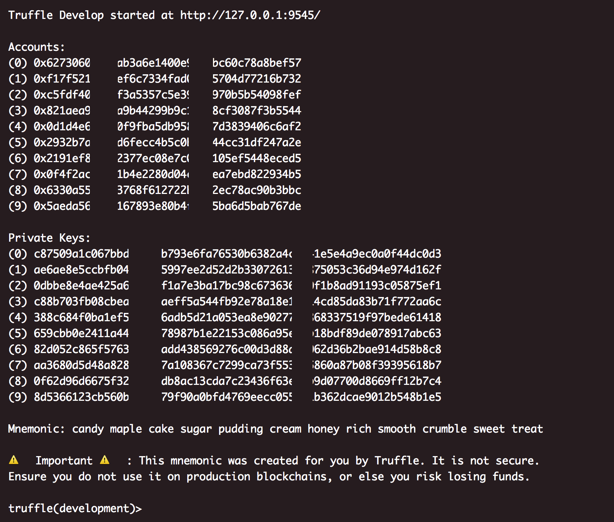
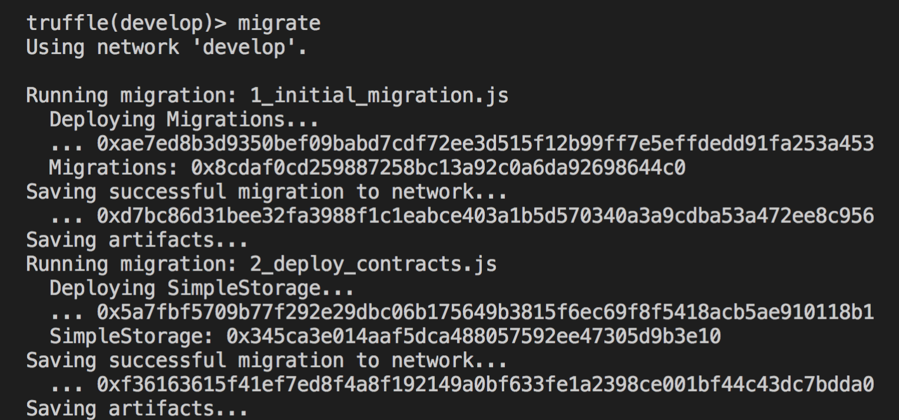
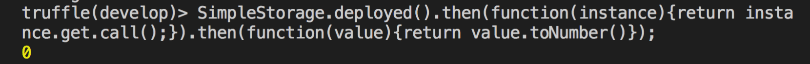
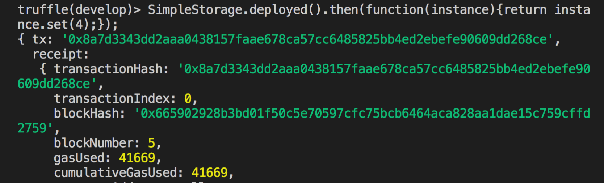
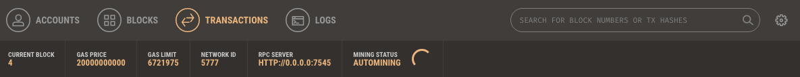
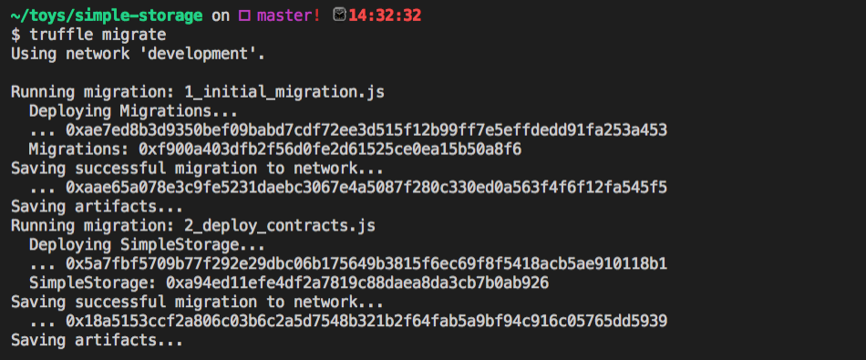
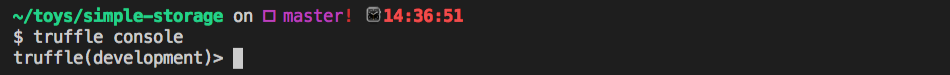

# 使用 Truffle 框架在測試環境發佈智能合約

#### 初始化專案

```sh
# 安裝 truffle
npm install -g truffle

# 建立一個空的資料夾
mkdir simple-storage
cd simple-storage

# 初始化專案
truffle init
```

初始化後，你可以看到三個資料夾

* contracts 目錄：存放智能合約原始碼的資料夾
* migrations 目錄：存放發佈合約的 script
* test 目錄：存放測試 script 的原始碼

跟四個檔案

* contracts/Migrations.sol

```js
pragma solidity ^0.4.23;

contract Migrations {
  address public owner;
  uint public last_completed_migration;

  constructor() public {
    owner = msg.sender;
  }

  modifier restricted() {
    if (msg.sender == owner) _;
  }

  function setCompleted(uint completed) public restricted {
    last_completed_migration = completed;
  }

  function upgrade(address new_address) public restricted {
    Migrations upgraded = Migrations(new_address);
    upgraded.setCompleted(last_completed_migration);
  }
}
```

* migrations/1_initial_migration.js

```js
var Migrations = artifacts.require("./Migrations.sol");

module.exports = function(deployer) {
  deployer.deploy(Migrations);
};
```

* truffle-config.js
* truffle.js：truffle 設定檔

**新增智能合約**

```js
// contracts/Store.sol
pragma solidity ^0.4.17;

contract SimpleStorage {
  uint myVariable;

  function set(uint x) public {
    myVariable = x;
  }

  function get() constant public returns (uint) {
    return myVariable;
  }
}
```

**新增部署的 script**

```js
// migrations/2_deploy_contracts.js
var SimpleStorage = artifacts.require("SimpleStorage");

module.exports = function (deployer) {
  deployer.deploy(SimpleStorage);
};
```

```sh
# 編譯智能合約
truffle compile

# 啟動 truffle 的主控台，同時開啟 develop 模式。
truffle develop
```

> develop 模式：開發環境在啟動時自動創建十組帳號，資料僅暫時在記憶體中，程式關掉後資料就會消失。



#### 部署智能合約到測試區塊鏈

```
migrate
```



#### 與智能合約互動

**取值**

```js
SimpleStorage.deployed()
  .then(function(instance){return instance.get.call();})
  .then(function(value){return value.toNumber()});
```



**設定值**

```js
SimpleStorage.deployed()
  .then(function(instance){return instance.set(4);});
```



完整輸出結果

```json
{ tx: '0x8a7d3343dd2aaa0438157faae678ca57cc6485825bb4ed2ebefe90609dd268ce',
  receipt:
   { transactionHash: '0x8a7d3343dd2aaa0438157faae678ca57cc6485825bb4ed2ebefe90609dd268ce',
     transactionIndex: 0,
     blockHash: '0x665902928b3bd01f50c5e70597cfc75bcb6464aca828aa1dae15c759cffd2759',
     blockNumber: 5,
     gasUsed: 41669,
     cumulativeGasUsed: 41669,
     contractAddress: null,
     logs: [],
     status: '0x01',
     logsBloom: '0x00000000000000000000000000000000000000000000000000000000000000000000000000000000000000000000000000000000000000000000000000000000000000000000000000000000000000000000000000000000000000000000000000000000000000000000000000000000000000000000000000000000000000000000000000000000000000000000000000000000000000000000000000000000000000000000000000000000000000000000000000000000000000000000000000000000000000000000000000000000000000000000000000000000000000000000000000000000000000000000000000000000000000000000000000000000' },
  logs: [] }
```

#### 與 Ganache 整合

Ganache 是一個可以使用於以太坊區塊鏈的圖形化工具，支援 Windows、Mac 和 Linux 作業系統。功能有部署智能合約、運行測試等等，前身是叫 `TestRPC`。

**Step1: 安裝 Ganache**

下載 Ganache：<https://truffleframework.com/ganache>，並安裝。

**Step2: 設定 truffle.js 檔**

```js
module.exports = {
  networks: {
    development: {
      host: "127.0.0.1",
      port: 7545,
      network_id: "*"
    }
  }
};
```

這裡的設定值是與 Ganache 對應



**Step3: migrate 修改的設定**

```sh
truffle migrate
```



**Step4: 進入 truffle 的主控台**

```
truffle console
migrate ––reset ––compile-all
```



完整原始碼：<https://github.com/alincode/simple-storage>