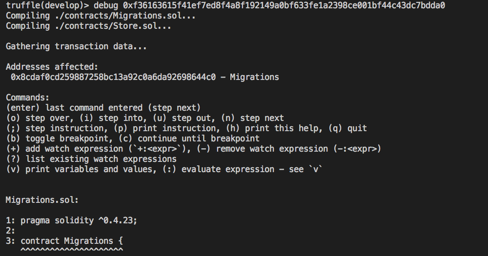

# 在 Truffle 上除錯

<!-- ### 無限循環 -->

將上一篇的 Store.sol 範例的 `set()` 函式改為以下內容

```js
function set(uint x) public {
  while(true) {
    myVariable = x;
  }
}
```

可以模擬出現無限循環的情境

```sh
truffle develop
```

發佈智能合約

```
migrate
```

執行智能合約的 `set` 函示

```js
SimpleStorage.deployed().then(function(instance){return instance.set(4);});
```

輸出結果

```
Error: VM Exception while processing transaction: out of gas
```

修復後，可以透過以下指令更新合約。

```
migrate --reset
```

> 可以透過 `truffle develop --log` 指令，再開一個主控台看 log。

truffle 內建 debug 工具，使用方式是在 truffle 的主控台輸入以下指令。

```
// 語法： debug tx-id
debug 0xf36163615f41ef7ed8f4a8f192149a0bf633fe1a2398ce001bf44c43dc7bdda0
```

會開啟 debug 模式逐行執行。



原始碼：<https://github.com/alincode/simple-storage-debugging>

<!-- ### 無效的錯誤檢查 -->
<!-- ### 沒有錯誤，但功能未按預期運行 -->
<!-- <https://truffleframework.com/tutorials/debugging-a-smart-contract> -->
