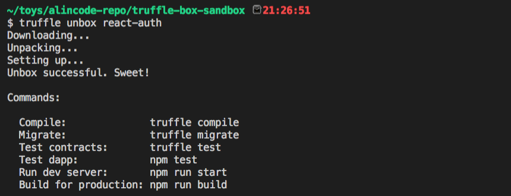

# Truffle 樣版

`Box` 是別人提供寫好的 `Truffle` 的樣版 (blueprint)，讓你可以快速開始開發 `DApp`。

> Truffle Boxes：<https://truffleframework.org/boxes/>

**安裝 truffle**

```sh
npm install -g truffle
```

輸入你要的樣版名稱，這邊使用的是 `unbox`。

```sh
# 語法：truffle unbox [box-name]
truffle unbox react-auth
```



```
.
├── <DIR> build
├── <DIR> config
├── <DIR> contracts
├── <DIR> migrations
├── <DIR> public
├── <DIR> scripts
├── <DIR> src
├── <DIR> test
├── LICENSE
├── package-lock.json
├── package.json
├── box-img-lg.png
├── box-img-sm.png
├── truffle-config.js
└── truffle.js
```

```
# 編譯智能合約
truffle compile

# 部署智能合約
truffle migrate

# 智能合約測試
truffle test
```

```sh
# 執行 DApp 測試
npm test

# 啟動 DApp，DApp 的位置會在 http://localhost:3000/
npm start

npm run build
```

### 熱門的樣版

**官方提供的樣版**

* drizzle
  * 內建 react.js 基礎建設
  * Github：<https://github.com/truffle-box/drizzle-box>
* react
  * Github：<https://github.com/truffle-box/react-box>
* react-auth
  * Github：<https://github.com/truffle-box/react-auth-box>

你可以從這裡找到更多官方提供的樣版：<https://github.com/truffle-box>

<!-- * devcon4：<https://github.com/truffle-box/devcon4-box> -->

**社群提供的熱門樣版**

* adrianmcli/truffle-next
  * 內建 next.js：<https://github.com/zeit/next.js/> 基礎建設
  * Github：<https://github.com/adrianmcli/truffle-next>
  * 使用說明：<https://truffleframework.org/boxes/truffle-next>
* ryhope/truffle-vue
  * Github：<https://github.com/ryhope/truffle-vue>
  * 使用說明：<https://truffleframework.org/boxes/truffle-vue>
* arvindkalra/express-box
  * Github：<https://github.com/arvindkalra/express-box>
  * 使用說明：<https://truffleframework.org/boxes/express-box>