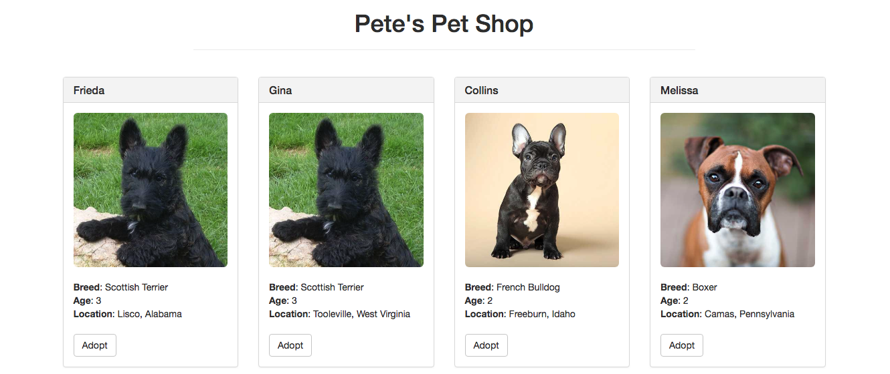
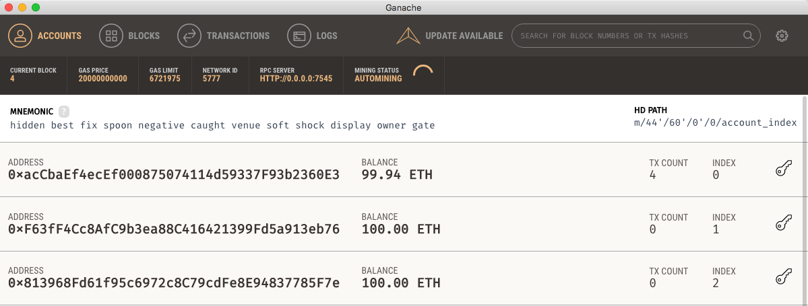
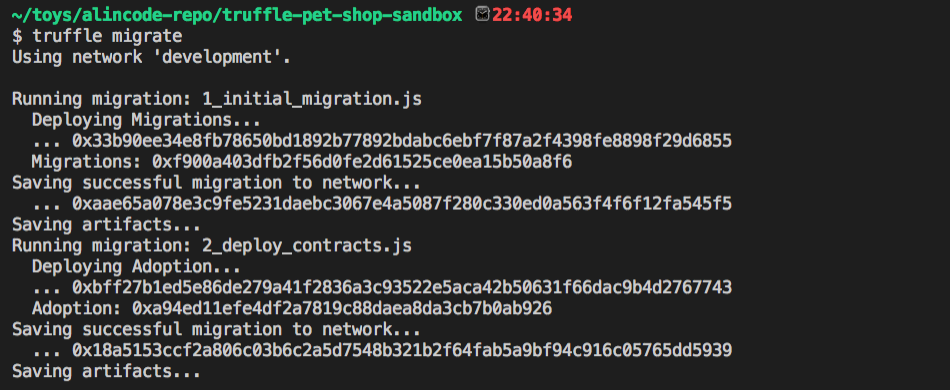
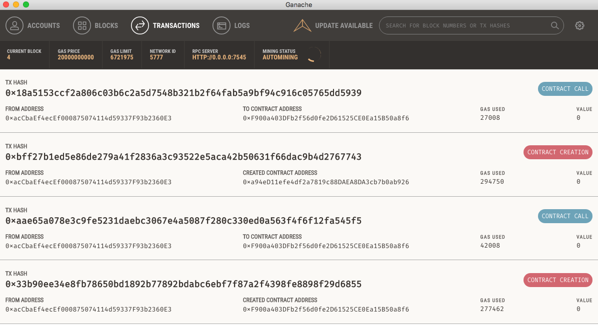

# Truffle - 使用寵物商店樣版快速開發 DApp (1/3)

#### Step 1：建立專案基礎建設

```sh
# 建立一個資料夾
mkdir truffle-pet-shop-sandbox

# 使用寵物商店樣版
truffle unbox pet-shop
```

#### Step 2：安裝 DApp 相依模組並啟動 DApp

```sh
# 安裝必要套件
npm install

# 執行 DApp
npm run dev
```




#### Step3：新增一個領養的智能合約

```sh
truffle create contract Adoption
```

```js
pragma solidity ^0.4.17;

contract Adoption {
  address[16] public adopters;
  
  modifier validAdoptId(uint petId) {
      require(petId >= 0 && petId < 16);
      _;
  }

  // 領養
  function adopt(uint petId) validAdoptId(petId) public returns (uint) {
    adopters[petId] = msg.sender;
    return petId;
  }

  function getAdopters() public view returns (address[16]) {
    return adopters;
  }
}
```

#### Step4：新增一個發佈智能合約的 script

在 `migrations` 資料夾裡新增一個 `2_deploy_contracts.js` 檔案

```js
// 這裡的名稱要對應到智能合約
var Adoption = artifacts.require("Adoption");

module.exports = function (deployer) {
  deployer.deploy(Adoption);
};
```

#### Step5：開啟測試鏈

開啟 Ganache



#### Step6：發布智能合約

Solidity 是編譯型語言，所以發佈前要先編譯過。

```sh
# 編譯
truffle compile

# 編譯並部署
truffle migrate

# 重新部署
truffle migrate --reset
```





今天先做到這，明日待續。