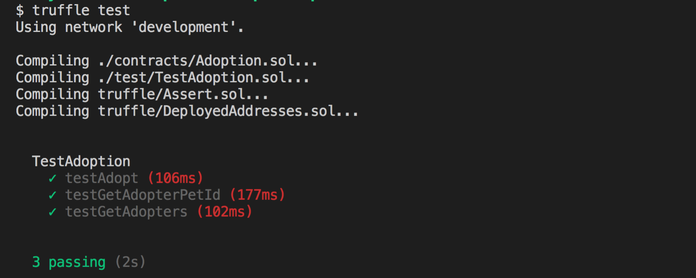

# 使用寵物商店樣版快速開發 DApp (2/3)

#### Step 7: 新增一個用 Solidity 語言的測試程式

測試程式要放在 `test` 的資料夾內，除了副檔名是 `.js`、`.es`、`.es6`、`.jsx` 和 `.sol` 的檔案之外，測試執行時會被忽略。

```js
// 驗證函式庫
import "truffle/Assert.sol";
// 發佈函式庫
import "truffle/DeployedAddresses.sol";
```

建立合約的實例

```js
contract TestAdoption {
  Adoption instance = Adoption(DeployedAddresses.Adoption());
}
```

呼叫合約函式的方式 `instance.functionName()`

```js
uint returnedId = instance.adopt(8);
```

驗證結果，第一個參數是實際回傳的值，第二個參數是期望的值，第三個參數值是錯誤提示。

```
Assert.equal(returnedId, expected, "debug Message");
```

**完整測試程式碼**

在 `test` 目錄新增一個 `TestAdoption.sol` 檔案

```js
pragma solidity ^0.4.17;

import "truffle/Assert.sol";
import "truffle/DeployedAddresses.sol";

// 這裡對應到你之前寫的智能合約
import "../contracts/Adoption.sol";

contract TestAdoption {
  Adoption instance = Adoption(DeployedAddresses.Adoption());

  // 測試領養
  function testAdopt() public {
    uint returnedId = instance.adopt(8);
    uint expected = 8;
    Assert.equal(returnedId, expected, "Adoption of pet ID 8 should be recorded.");
  }

  function testGetAdopterPetId() public {
    address expected = this;
    address adopter = instance.adopters(8);
    Assert.equal(adopter, expected, "Owner of pet ID 8 should be recorded.");
  }

  function testGetAdopters() public {
    address expected = this;
    address[16] memory adopters = instance.getAdopters();
    Assert.equal(adopters[8], expected, "Owner of pet ID 8 should be recorded.");
  }
}
```

#### Step 8: 執行測試

```sh
# 執行所有測試
truffle test

# 執行指定的測試
truffle test ./test/TestAdoption.sol
```



#### Step 9: 新增一個用 Javascript 語言的測試程式

truffle 的 `javascript` 是使用 `mocha` 跟 `chai` 模組，但要把 `describe()` 語法換成 `contract()` 語法。

> mocha 模組：<https://mochajs.org/>
> chai 模組：<https://www.chaijs.com/>

```sh
# 產生測試程式樣版
truffle create test Adoption
```

你可以從 `test` 目錄找到 truffle 自動產生的測試程式，檔名叫 `adoption.js` ，內容如下：

```js
contract('Adoption', function (accounts) {
  it("should assert true", function (done) {
    var adoption = Adoption.deployed();
    assert.isTrue(true);
    done();
  });
});
```

須在第一行手動加入以下的程式碼來匯入智能合約。

```js
var Adoption = artifacts.require("Adoption");
```

> `artifacts.require()` 文件：<https://truffleframework.com/docs/truffle/getting-started/running-migrations#artifacts-require->

#### Step 10: 自訂測試邏輯

在測試裡內建一個 `web3` 實例，所以你可以直接使用 `web3.eth.getBalance` 語法，也支援 async/await 語法。

```js
var Adoption = artifacts.require("Adoption");

contract('Adoption', async (accounts) => {
  it("should assert true", async () => {
    var adoption = await Adoption.deployed();
    assert.isTrue(true);
  });
});
```

執行 javascript 測試

```sh
truffle test ./test/adoption.js
```

今天先做到這，明日待續。