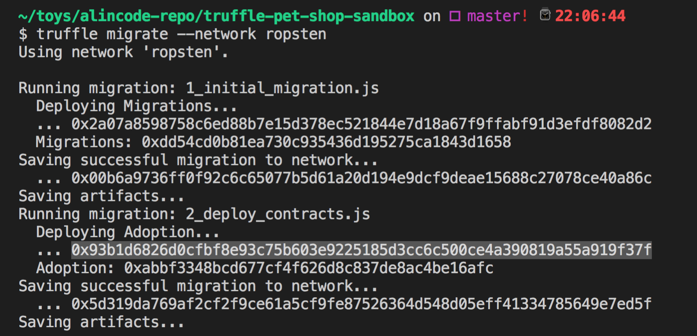
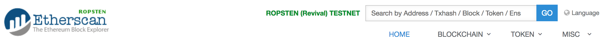
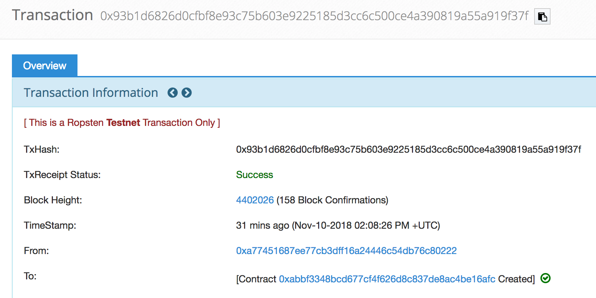

# Truffle 與 Infura 整合快速部署智能合約｀

**Step 1：安裝模組 truffle-hdwallet-provider**

```sh
npm i truffle-hdwallet-provider --save
```

**Step 2：匯入模組**

```sh
var HDWalletProvider = require("truffle-hdwallet-provider");
```

**Step 3：在設定檔新增 ropsten 網路的設定**

```js
ropsten: {
  provider: function () {
    return new HDWalletProvider(process.env.MNEMONIC, "https://ropsten.infura.io/v3/" + process.env.INFURA_API_KEY);
  },
  network_id: '3',
},
```

**完整的 truffle.js 檔範例**

```js
var HDWalletProvider = require("truffle-hdwallet-provider");

module.exports = {
  // See <http://truffleframework.com/docs/advanced/configuration>
  // for more about customizing your Truffle configuration!
  networks: {
    ropsten: {
      provider: function () {
        return new HDWalletProvider(process.env.MNEMONIC, "https://ropsten.infura.io/v3/" + process.env.INFURA_API_KEY);
      },
      network_id: '3',
    },
    development: {
      host: "127.0.0.1",
      port: 7545,
      network_id: "*" // Match any network id
    }
  }
};
```

**Step 4：設定環境變數**

```sh
# 助記詞
export MNEMONIC="....."

# INFURA 的 API KEY
export INFURA_API_KEY="..."
```

> 在當你 MetaMask 註冊以太坊帳號的時候，當時你就會拿到一組助記詞(mnemonic)。

**Step 5：智能合約部署至 ropsten 網路**

```sh
# 編譯
truffle compile

# 部署
truffle migrate --network ropsten
```

我特別標注反白的地方，就是部署成功後的合約位址。



不相信的話，你可以把它複製到 etherscan ropsten 再次確認。

> etherscan ropsten：<https://ropsten.etherscan.io/>



查詢後的結果，如下圖所示：

