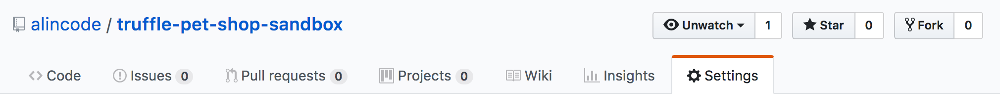
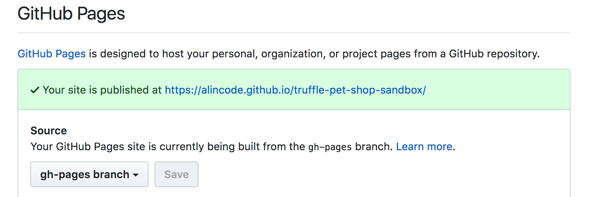

# DApp 發佈到 Github Page

因為我們要發佈的 DApp 比較單純，不需要太多的編譯跟打包，所以只使用一些小模組就可以完成。如果你需要複雜的步驟，就需要考慮用 `webpack` 來打包。

* recursive-copy：是複製檔案模組
* gh-pages：是 github page 模組

> webpack：<https://webpack.js.org/>

**Step 1：安裝模組**

```sh
npm install recursive-copy --save-dev
npm install gh-pages --save-dev
```

**Step 2：自訂 build script**

build.js

```js
var copy = require('recursive-copy');

async function init() {
  await copy('src', 'dist');
  await copy('build/contracts', 'dist');
}

init();
```

**Step 3：新增 build 跟 deploy 指令**

```
"scripts": {
  "dev": "lite-server",
  "build": "node build.js",
  "deploy": "gh-pages -d dist",
  "test": "truffle test"
},
```

**Step 4：執行部署**

```sh
npm run build
npm run deploy
```

線上 Demo：<https://alincode.github.io/truffle-pet-shop-sandbox/>

**Step 5：確認 Github Page 的設定**



