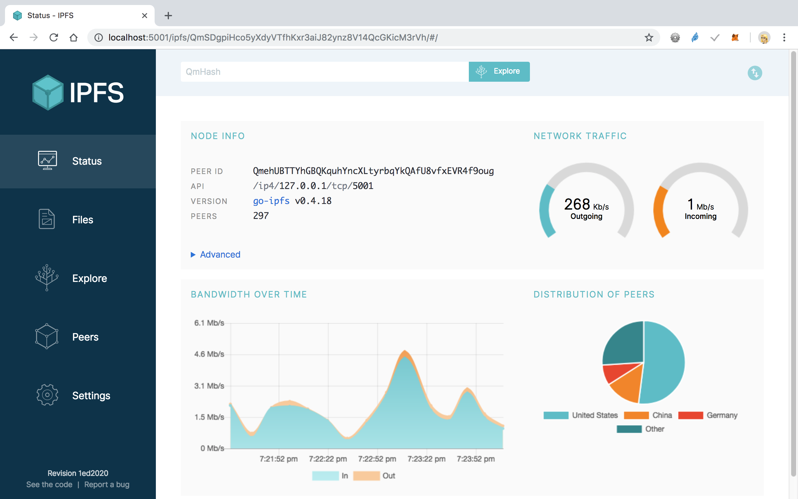

# 將 DApp 發佈到 IPFS

IPFS (InterPlanetary File System) 是點對點 (p2p) 的分散式檔案系統，目的是要建立分散式共用檔案的網路協定，解決 WWW 機制的一些缺點。例如目前網路上存在很多重複的檔案，即使內容一樣，也有可能不止保留一份。

IPFS 向 Git 一樣為每個檔案建立一個 hash 值，可以辨識是否為相同的檔案。分散式的架構可以避免單點故障並防止 DDos 攻擊，在傳遞內容時也可以節約頻寬用量。

因為 IPFS 的 hash 值會因內容變動而改變，所以有另一個服務叫 IPNS，可以登錄 IPNS 跟 IPFS 的對應，讓你發佈 DApp 時，還是可以固定一組位址。

> IPFS 官方文件：<https://docs.ipfs.io/>

**搜尋 IPFS 的 docker image**

```sh
docker search ipfs
```

```
$ docker search ipfs
NAME                DESCRIPTION                                     STARS               OFFICIAL            AUTOMATED
ipfs/go-ipfs        Go implementation of IPFS, the InterPlanetar…   53                                      [OK]
jbenet/go-ipfs                                                      20                                      [OK]
ipfs/ipfs-cluster   Collective pinning and composition for IPFS.    5                                       [OK]
```

**執行 IPFS Docker 容器**

```sh
cp -r [some_folder] /Volumes/Transcend/ipfs/export
export ipfs_staging=/Volumes/Transcend/ipfs/export
export ipfs_data=/Volumes/Transcend/ipfs/data

docker run -d --name ipfs_host -v $ipfs_staging:/export -v $ipfs_data:/data/ipfs -p 4001:4001 -p 127.0.0.1:8080:8080 -p 127.0.0.1:5001:5001 ipfs/go-ipfs:latest
```

**IPFS 後台管理介面**

<http://localhost:5001/webui>



**將檔案上傳至 IPFS**

```sh
docker exec -it ipfs_host /bin/sh
ipfs add -r /export/
```

上傳完後會取得 `ipfs-hash`

```
...其他省略
added QmV3LyHokfUH1kp94Nrxn8q1E8p95Kt9kfKfJSUpXsGc6Q export/index.html
added QmNXRFREw7waGtKW9uBUze3PkR9E12HeeAQSkZQSiFUJqo export/js/bootstrap.min.js
added QmZQp29tbdppjqyixxM8L8NjsG4paN4eVW9GxZYicXov9v export/js/truffle-contract.js
added QmdTtsVM7KtvycQ68f9M43N4EQKvbd58q8aeAhP2fMz4Di export/js/web3.min.js
added QmZKHAuYoeAjHqfhi2jJaELDfMBj6dtydz7UsZv3BPaon8 export/pets.json
added QmQfwrATTrJc1aTN1dVu9K7nQ5rw67np8yg46EvAbqKEZw export/css
added Qmb3fJpXVGvUnNeRLC3P5sTXMzjpf5zq4tKt9XjhtYFf1k export/fonts
added QmQo4AjSx9JkNsHa3nRqxtryx6iGHmqGprhm2ic2MztW3Y export/images
added QmefTiYgFbRy1VDWmLj627eu1i6GEbzX5t7g777Hy8T9Eg export/js
added QmXFfz77czDKWpKmvHGYenZhLuisxfVpZpqHt8p8f6C3dE export
```

**開啟 Demo 頁面**

<https://ipfs.io/ipfs/QmXFfz77czDKWpKmvHGYenZhLuisxfVpZpqHt8p8f6C3dE/>

**其他常用指令**

```sh
# 查看 log
docker logs -f ipfs_host

# 停止容器
docker stop ipfs_host

# 查看內容
ipfs cat /ipfs/QmV3LyHokfUH1kp94Nrxn8q1E8p95Kt9kfKfJSUpXsGc6Q

# docker exec ipfs_host [指令]
docker exec ipfs_host ipfs add -r /export/
```

#### 延伸閱讀

* IPFS docker image : <https://hub.docker.com/r/ipfs/go-ipfs/>
* go-ipfs : <https://github.com/ipfs/go-ipfs>
* [DEVCON1: IPFS - Juan Batiz-Benet 影片](https://www.youtube.com/watch?v=ewpIi1y_KDc)
* [Golang打造下一代互联网 IPFS全解析 余长洪 - YouTube](https://www.youtube.com/watch?v=JyJ7Kd1POrc)